# Okta-Zero-Trust-IAM
Implementing a hardened Zero-Trust identity perimeter using Okta, featuring adaptive MFA, network zones, and NIST-compliant credential policies.
# Okta Zero-Trust IAM Implementation
**Architecting an enterprise identity perimeter with Okta, featuring adaptive MFA, network zones, and NIST-compliant credential hardening.**

### **Project Overview**
This project demonstrates the implementation of a **Zero-Trust Identity and Access Management (IAM)** framework using the Okta Identity Cloud. The goal was to engineer a hardened identity perimeter that enforces context-aware access controls, adaptive multi-factor authentication (MFA), and NIST-compliant credential policies. 

### **Technologies & Tools Used**
* **Identity Provider**: Okta Identity Cloud
* **Security Framework**: Zero-Trust Architecture
* **Authentication**: Adaptive MFA (Okta Verify), Windows Hello
* **Compliance**: NIST Password Complexity Standards
* **Monitoring**: Okta System Logs (SIEM Telemetry)

---

### **1. Network Perimeter Configuration and Trusted Zones**
I established the organization’s digital boundary by configuring a **Trusted IP Zone**. By defining a **"Corporate Network"** via specific Gateway IPs, I created the necessary telemetry for the system to distinguish between verified internal traffic and untrusted external requests. 

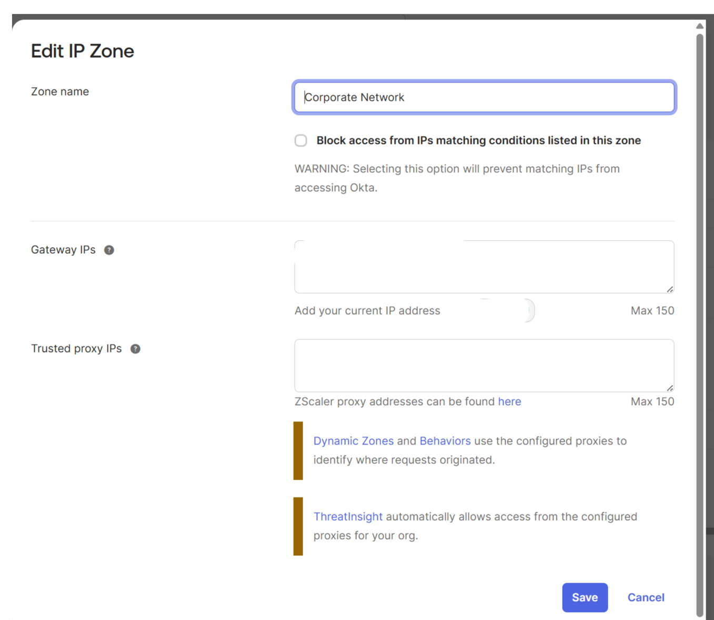

---

### **2. Adaptive MFA Orchestration and Identity Governance**
I engineered a comprehensive **MFA Enrollment Policy** targeted at privileged groups. I implemented **Role-Based Access Control (RBAC)** to ensure that different segments of the identity lifecycle are governed by appropriate security triggers.

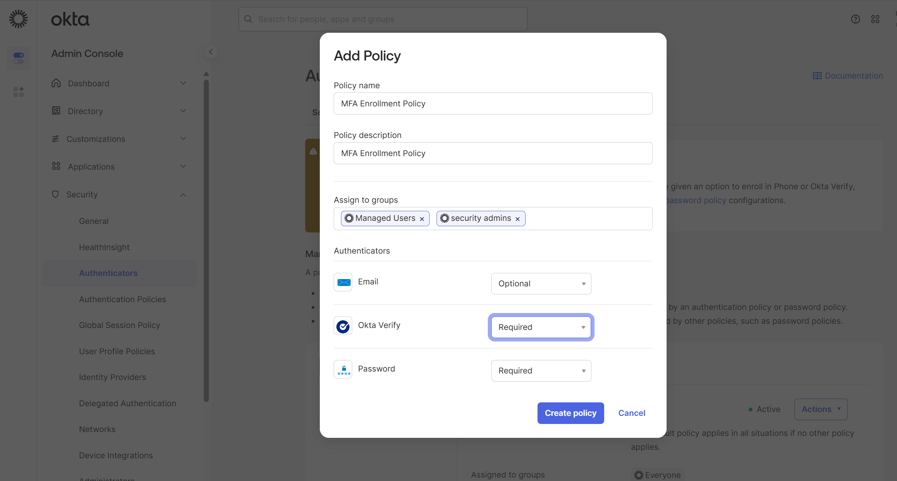

---

### **3. Context-Aware Enrollment and Geofencing Logic**
I established the conditional logic governing the enrollment gateway. This enforces a **geofencing** strategy where enrollment is only allowed if the user’s IP originates from the pre-defined **"Corporate Network"** zone.

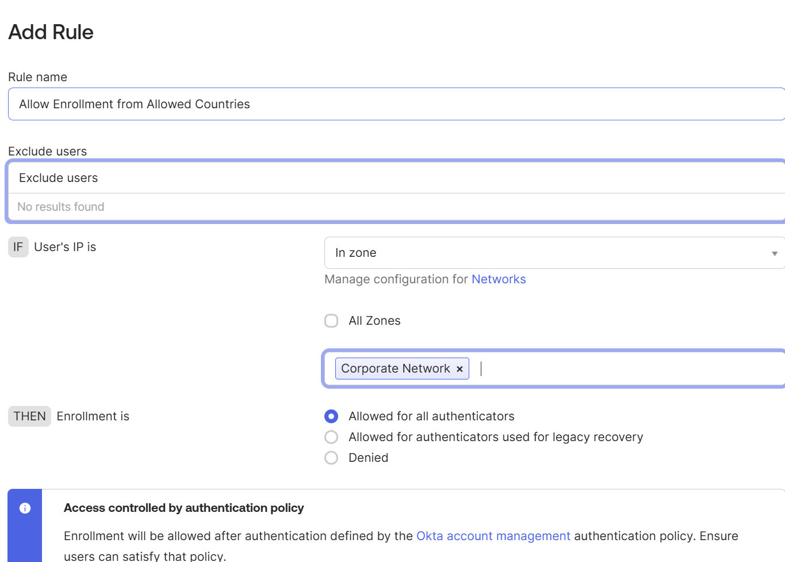

---

### **4. Policy Hierarchy and Authenticator Enrollment Summary**
This overview confirms the successful orchestration of the **MFA Enrollment Policy** at **Priority 1**. This ensures that specialized security requirements take precedence over the standard "Default Policy."

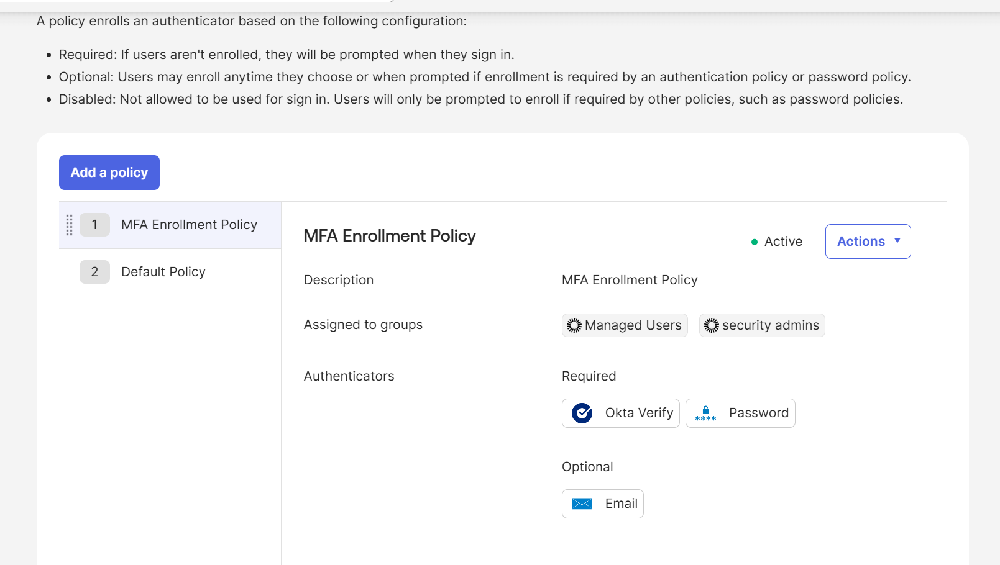

---

### **5. Zero-Trust Boundary: The "Implicit Deny" Rule**
I implemented the final safety net: a global **"Deny Enrollment"** rule. When an authentication request does not meet the specific "Allow" criteria, it falls through to this rule where access is explicitly **Denied**.

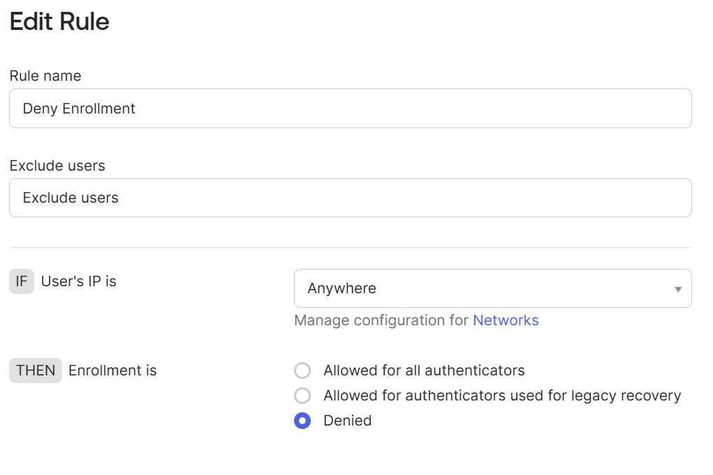

---

### **6. Password Governance and Complexity Hardening**
I implemented a rigorous **Password Requirement** policy aligning with **NIST-standard guidelines**, establishing a **12-character minimum length** to increase the computational cost of brute-force attacks.

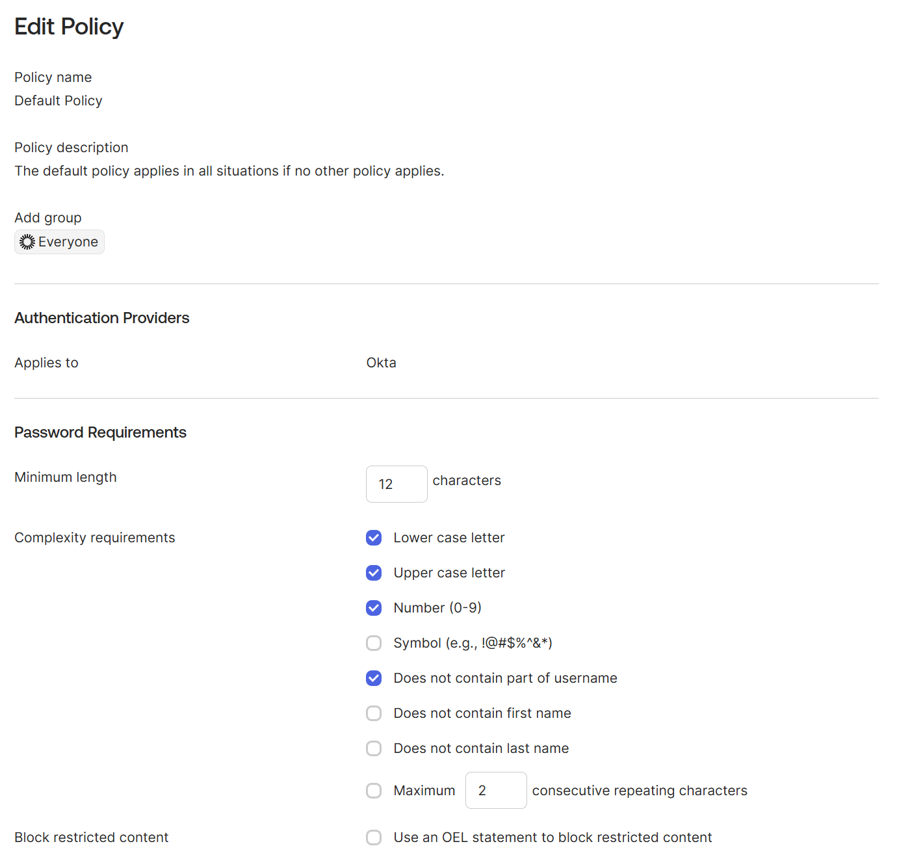

---

### **7. Account Lockout Policies and Brute-Force Mitigation**
I implemented a strict **Lockout Policy** to defend against automated credential-stuffing. The configuration enforces a **lockout after 3 unsuccessful attempts** with a 30-minute automatic unlock.

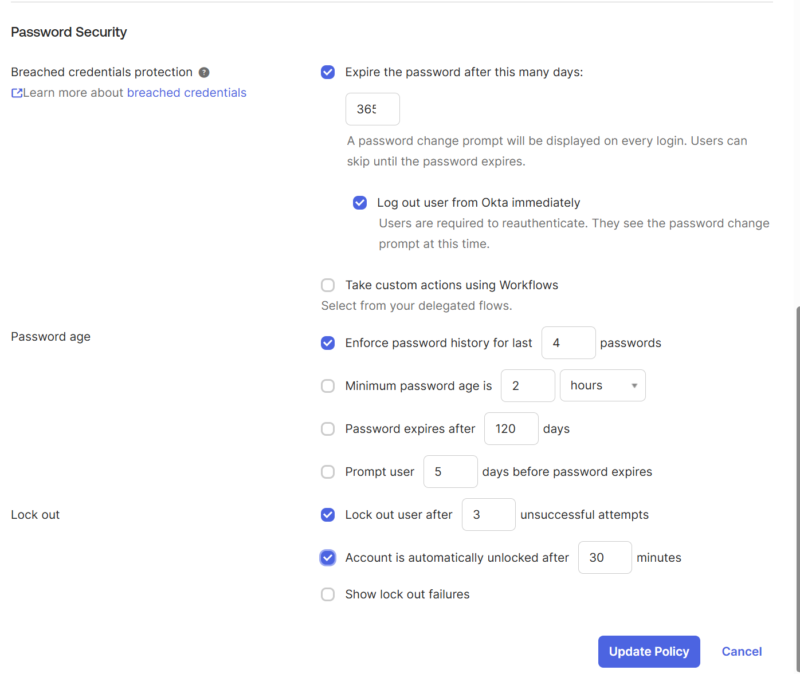

---

### **8. User Identity Verification Challenge**
The platform requires the test user to initiate a verification email. This **Out-of-Band (OOB)** authentication step ensures that the user has physical control over the secondary communication channel.

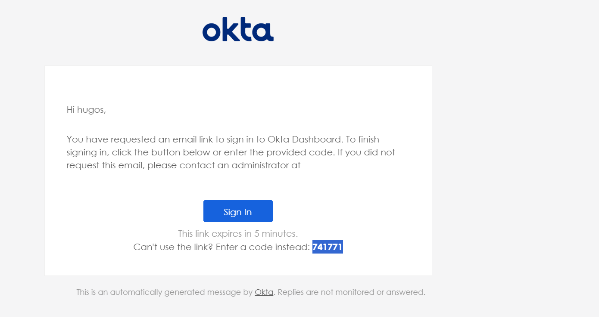

---

### **9. User Enrollment Flow: MFA Trigger**
This step validates that the **MFA Enrollment Policy** is correctly triggering. The user is prompted to request a verification email, protecting against unauthorized or accidental sign-in requests.

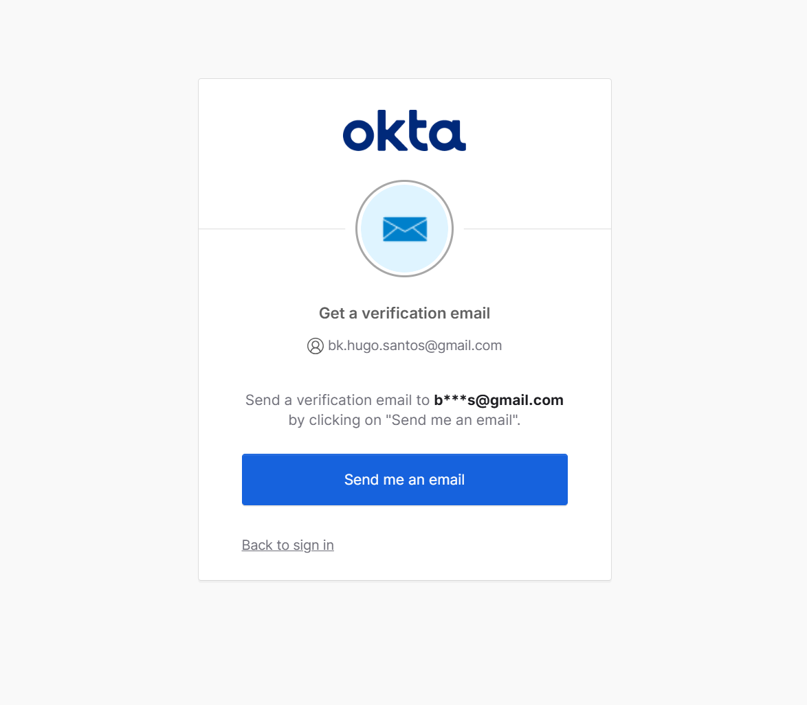

---

### **10. Factor Enrollment Completion and Endpoint Verification**
This validates the successful enrollment of **Okta Verify** on the target device. It demonstrates integration with local device security features like **Windows Hello**.

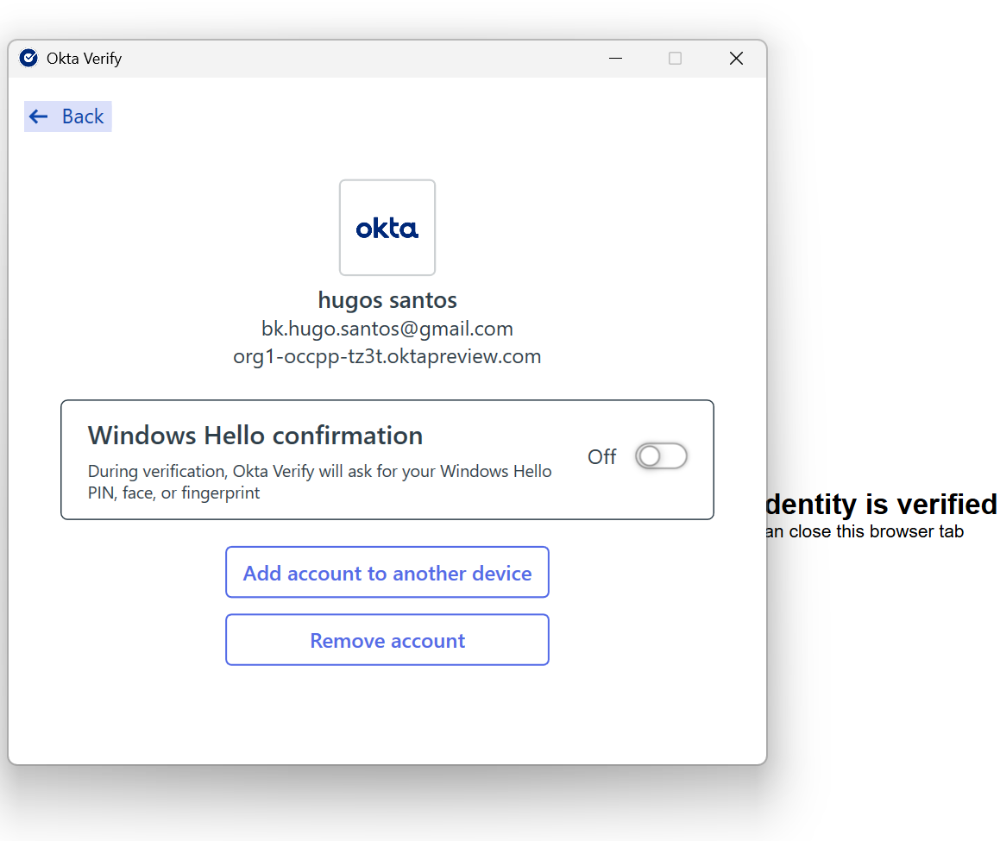

---

### **11. Final Dashboard Access and Portal Entry**
Once all security criteria are met, the user is granted access to the end-user dashboard. This proves the successful end-to-end execution of the Zero-Trust access flow.

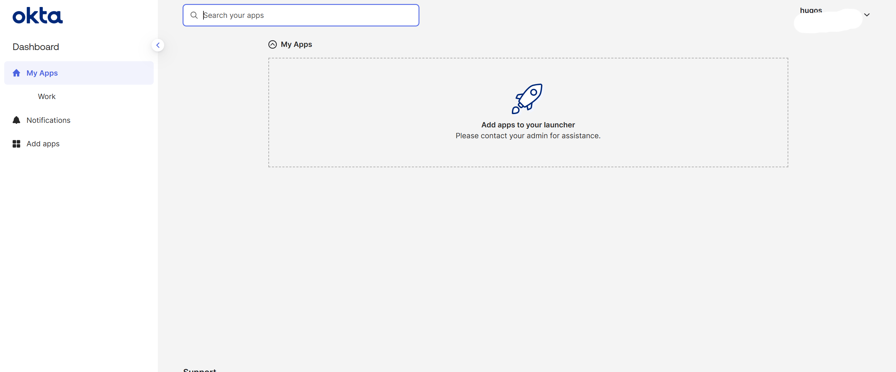

---

### **12. Auditing and Compliance: System Log Verification**
The final component provides forensic proof. As captured in the **Okta System Logs**, the event `user.mfa.factor.activate` was recorded with a status of **SUCCESS**, confirming the policies were executed correctly.

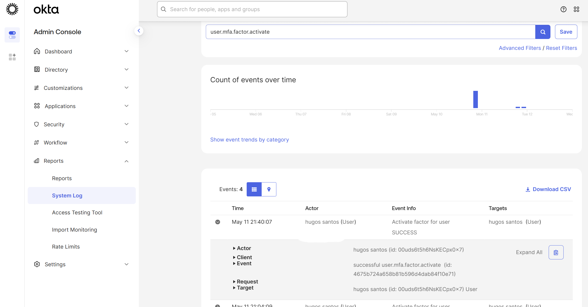

---

> ### **Final Conclusion**
> This implementation demonstrates that **Identity is the new perimeter.** By moving away from static passwords toward an **Adaptive, Zero-Trust model**, I have significantly reduced the organizational attack surface while maintaining a seamless user experience.
